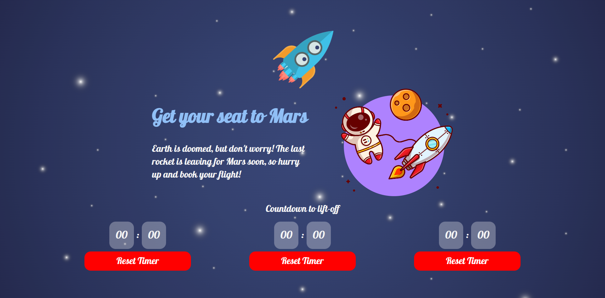

# Rocket

Three flights to Mars are waiting for you. Dont' miss the countdown !

## Live Demo

A live demo is available [here](https://rocket-kappa.vercel.app/)

## How does it work ?

Rocket is a responsive group of timers with the daily timetable for rockets to Mars, so you don't miss the next one.

## Customization

`INITIAL_VALUE_SECONDS`

This is how long you have to wait between rockets

`SECONDS_BETWEEN_TIMERS`

By default, timers are set 10 seconds apart from each other.

`TICK_IN_MILLISECONDS`

Time is relative in space. Speed up time if you can't wait.

`NUMBER_OF_COUNTERS`

Still too slow? Add a few more rockets in the daily schedule

### Technologies used

Bundler: Vite
Typescript, React 18
SCSS